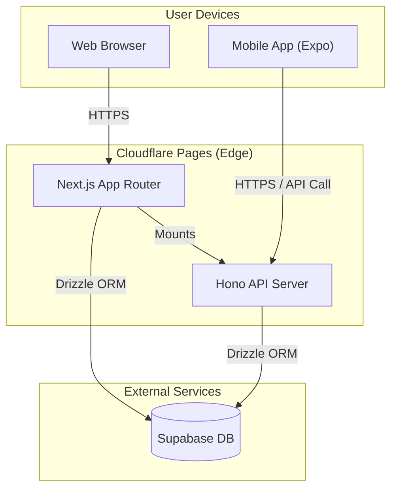

# Bun Turbo Monorepo Starter

[](https://bun.sh)


**Web (Next.js)** と **Mobile (Expo)** の両方を **Bun** と **Turborepo** で管理する、モダンなモノレポテンプレートです。
バックエンド（API）は **Hono** を採用し、Next.jsのEdge Runtime上で動作します。WebとMobile間で型定義（RPC）を共有し、Type-Safeな開発を実現します。

## 🌟 Features

- **Monorepo:** [Turborepo](https://turbo.build/) による高速なビルドとタスク管理
- **Runtime & PM:** [Bun](https://bun.sh/) による超高速なインストールと実行
- **Web:** Next.js (App Router) + [shadcn/ui](https://ui.shadcn.com/)
- **Mobile:** React Native ([Expo SDK](https://expo.dev/))
- **Backend:** [Hono](https://hono.dev/) (mounted on Next.js Route Handlers) with RPC
- **Database:** [Supabase](https://supabase.com/) (Production) / Docker (Local)
- **ORM:** [Drizzle ORM](https://orm.drizzle.team/)
- **Deployment:** Cloudflare Pages (Edge Runtime) compatible

---

## 🏗 Architecture

WebフロントエンドとAPIサーバーは同居し、エッジネットワーク上で動作します。Mobileアプリは同一のAPIを利用します。



## 🚀 Deployment Targets

| Component | Technology | Deployment Target | Note |
| --- | --- | --- | --- |
| **Web Frontend** | Next.js (App Router) | **Cloudflare Pages** | Edge Runtime (`export const runtime = 'edge'`) |
| **API Server** | Hono | **Cloudflare Pages** | `/api/*` にマウントされ、Webと共にデプロイされます |
| **Mobile App** | React Native (Expo) | **App Store / Google Play** | EAS Build 等を使用 |
| **Database** | PostgreSQL | **Supabase** | Cloudflareからは `postgres` ドライバで接続 |

---

## 🛠 Project Structure

```text
.
├── apps
│   ├── web/            # Next.js Application (Web + API)
│   └── mobile/         # Expo Application (iOS / Android)
├── packages
│   ├── db/             # Drizzle Schema & DB Connection
│   ├── api/            # Shared API Logic & RPC Types
│   ├── ui/             # (Optional) Shared UI Components
│   └── config/         # Shared configurations (Biome, TSConfig)
├── docker-compose.yml  # Local Database (PostgreSQL)
└── turbo.json          # Turborepo Configuration
```

## Getting Started
Prerequisites
- Bun (v1.0 or later)
- Docker (For local database)

1. Clone & Install
```Bash
git clone [https://github.com/your-username/bun-turbo-monorepo.git](https://github.com/your-username/bun-turbo-monorepo.git)
cd bun-turbo-monorepo
bun install
```

2. Environment Setup
ルートディレクトリの .env.example をコピーして .env を作成します。

```Bash
cp .env.example .env
```

3. Start Local Database
Dockerを使用してローカル用のPostgreSQLを起動します。

```Bash
docker-compose up -d
```

4. Database Migration
Drizzle ORMを使用して、スキーマをローカルDBに適用します。

```Bash
# スキーマの適用 (Push)
bun run db:push
```

5. Run Development Server
WebとMobileの開発サーバーを同時に起動します。

```Bash
bun dev
```
- Web: http://localhost:3000
- Mobile: Press i for iOS simulator, a for Android emulator (in the terminal window)

## 📦 Database Management
Drizzle Kitを使用しています。packages/db ディレクトリで定義されています。

```Bash
# スキーマ変更をローカルDBに反映 (Prototyping)
bun run db:push

# マイグレーションファイルの生成
bun run db:generate

# マイグレーションの実行
bun run db:migrate

# Drizzle Studio (GUI) の起動
bun run db:studio
```

📝 Scripts
ルートディレクトリ (package.json) から実行できる主なコマンドです。

- bun dev: 開発サーバーの起動 (Web & Mobile)
- bun run build: ビルド (Next.js & Type Check)
- bun run lint: コードの静的解析 (Biome)
- bun run format: コードのフォーマット (Biome)
- bun run type-check: TypeScriptの型チェック
- bun test: テストの実行

## 🤝 Contributing
Fork the repository

1. Create your feature branch (git checkout -b feature/amazing-feature)
2. Commit your changes (git commit -m 'Add some amazing feature')
3. Push to the branch (git push origin feature/amazing-feature)
4. Open a Pull Request

## 📄 License
MIT
